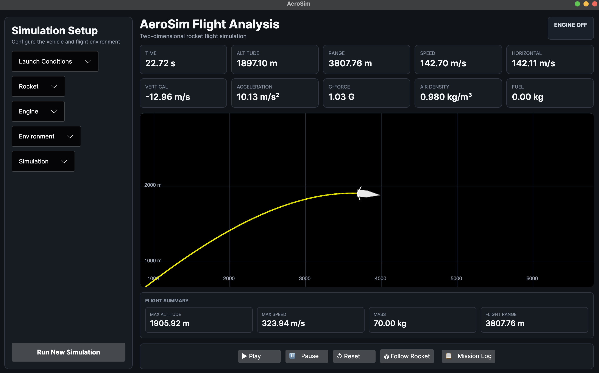
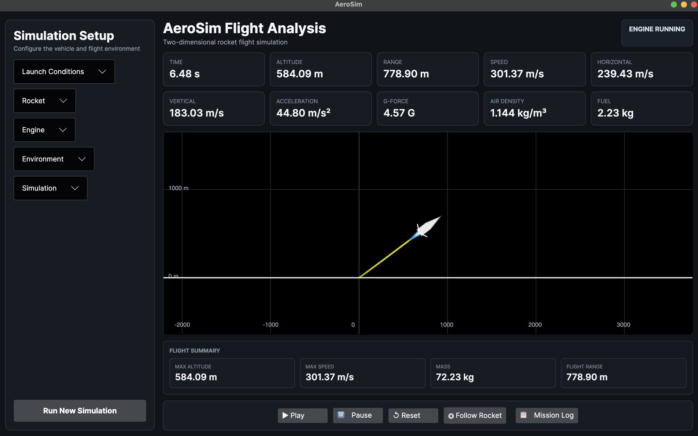
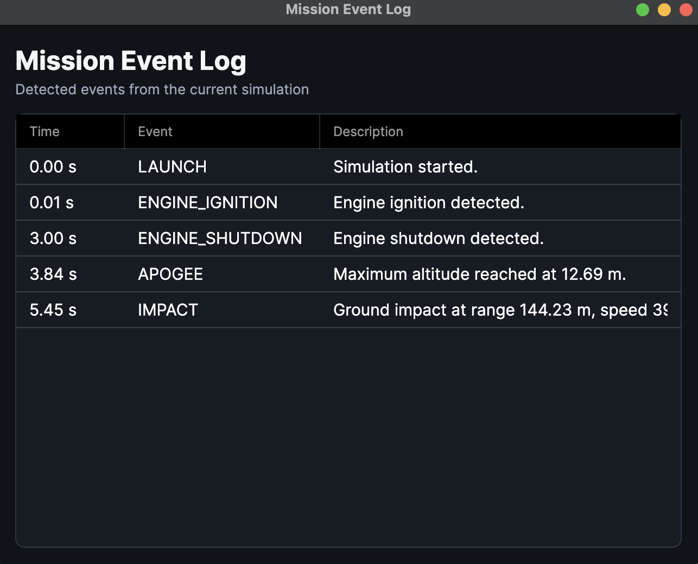
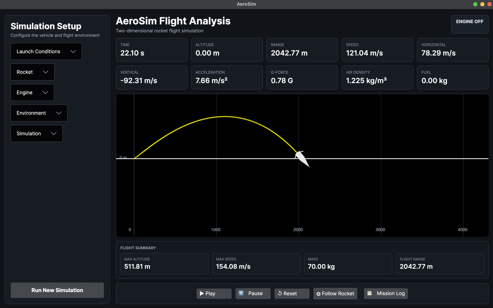

# 🚀 AeroSim

A modular 2D rocket flight simulation built with C#, .NET 10 and Avalonia UI.


---

## Overview

AeroSim is a real-time rocket flight simulation that models thrust, gravity, aerodynamic drag, fuel consumption, atmospheric density and vehicle dynamics.

The application provides live visualization, telemetry, mission event tracking and CSV export using a clean layered architecture.

---

## Demo

https://github.com/Inon-Kadosh/AeroSim/blob/main/screenshots/demo.mp4

---

## Screenshots

| Main Window | Live Flight |
|--------------|-------------|
|  |  |

| Mission Log | Final Statistics |
|--------------|------------------|
|  |  |


---

## Features

- Real-time flight simulation
- Physics-based motion
- Gravity
- Aerodynamic drag
- Fuel consumption
- Atmospheric density model
- Live telemetry
- Mission events
- Camera follow mode
- Pan & Zoom
- CSV export

---

## Architecture

```
                +----------------------+
                |    Avalonia UI       |
                |  MainViewModel       |
                +----------+-----------+
                           |
                           v
                +----------------------+
                |  SimulationService   |
                +----------+-----------+
                           |
                           v
                +----------------------+
                | LiveSimulationSession|
                +----------+-----------+
                           |
                           v
                +----------------------+
                |    PhysicsEngine     |
                +----------+-----------+
                           |
        +------------------+------------------+
        |                  |                  |
        v                  v                  v
+---------------+  +---------------+  +---------------+
| GravityForce  |  |  DragForce    |  | ThrustForce   |
+---------------+  +---------------+  +---------------+
                           |
                           v
                +----------------------+
                |     VehicleState     |
                +----------+-----------+
                           |
                           v
                +----------------------+
                |  Telemetry / Summary |
                +----------------------+
```

### Project Structure

```
AeroSim.App
├── MVVM
├── Rendering
├── Controls
└── Services

AeroSim.Simulation
├── Physics
├── Forces
├── Engine
├── Analysis
├── Systems
└── Environment

AeroSim.Core
├── Models
└── Mathematics

AeroSim.Infrastructure
└── CSV Export
```

---

## Simulation Pipeline

Each simulation step follows the same execution flow:

```text
Simulation Step
      │
      ▼
FuelSystem
(Update fuel & mass)
      │
      ▼
Force Models
(Gravity + Drag + Thrust)
      │
      ▼
PhysicsEngine
ΣF = ma
      │
      ▼
Acceleration
      │
      ▼
Velocity
      │
      ▼
Position
      │
      ▼
LiveSimulationSession
      │
      ├── Update Summary
      ├── Store Telemetry
      └── Detect Mission Events
```

This separation keeps the physics engine independent from the user interface while allowing new force models and analysis modules to be added without modifying the simulation core.

---

## Key Design Decisions

### Modular Force System

All forces implement the `IForceModel` interface.

This allows new force models (such as wind, lift or custom propulsion systems) to be added without changing the physics engine.

### Separation of Responsibilities

- **Core** contains domain models and mathematics.
- **Simulation** contains the physics engine and simulation logic.
- **Infrastructure** contains external services such as CSV export.
- **App** contains the Avalonia UI and MVVM presentation layer.

### Live Simulation

The simulation runs incrementally using `LiveSimulationSession`, allowing the UI to update in real time while telemetry and mission events are generated continuously.

---

## Technologies

- C#
- .NET 10
- Avalonia UI
- CommunityToolkit.Mvvm
- Object-Oriented Programming (OOP)
- MVVM
- SOLID Principles
- Physics Simulation

---

## Future Improvements

- Wind model
- Multi-stage rockets
- Configurable atmosphere models
- Simulation playback
- Telemetry graphs
- 3D visualization
- Multiple rocket presets

---

## Getting Started

### Clone the repository

```bash
git clone https://github.com/Inon-Kadosh/AeroSim.git
```

### Build

```bash
dotnet build
```

### Run

```bash
dotnet run --project AeroSim.App
```

---

## Author

**Inon Kadosh**

Software Engineering Student

